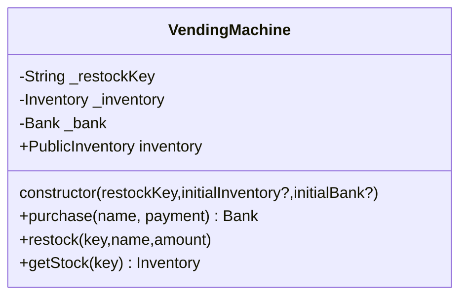

# Very Vending Machinations

Welcome! Our exercise today will be implementing
a class that acts like a vending machine!
There is a stub class in [vending-machine.js](./vending-machine.js) called `VendingMachine`.

You will be implementing all currently unimplemented methods. These include:

- `constructor`
  - The constructor takes one required and two optional arguments
    - `restockKey`
      - Required
      - The restock key for this instance of the class
    - `initialInventory`
      - Optional
      - The initial inventory for this instance of the class
    - `initialBank`
      - Optional
      - The initial inventory for this instance of the class
  - This should throw if the `restockKey` is empty
- `inventory`
  - This is a public getter for reading the current available items and their cost
  - Should not return the quantity of items, just the name and cost
  - Should not include items with 0 inventory
- `purchase`
  - This public method is used for purchasing an item. It takes in the name of
  the item, and the payment and returns the change in the form of a `Bank` object.
  - The payment must be `>=` to the cost of the item
  - The item must exist in the inventory and have a `> 0` quantity
  - The returned change should be the ideal set (Using the fewest number of coins)
  - Should throw on an item that doesn't exist in the inventory
  - Should throw if insufficient payment
  - Should throw if the bank doesn't have sufficient change
- `restock`
  - This public method is used for restocking items in the vending machine
  - Requires a restock key, must match the instances restock key
  - If the name doesn't currently exist in the inventory add it, otherwise add
  `amount` to the existing stock
  - Should throw if the restock key doesn't match the instances restock key
- `getStock`
  - This public method gets the current stock of the vending machine. It is
  similar to the `inventory` getter, but also returns the stock of the item,
  not just the name and cost
  - Requires a restock key, must match the instances restock key
  - Should throw if the restock key doesn't match the instances restock key

## Testing

This repo follows TDD (Test Driven Development).
I have supplied a test suite in [vending-machine.test.js](./vending-machine.test.js),
so the goal is to implement the `VendingMachine` class such
that all those tests pass.

## Errors

I have provided a base set of errors in [errors.js](./errors.js).
Feel free to look at the test suite for hints on when to use which error

## Types

This project uses [JSDoc](https://jsdoc.app/) comments for type hints.
This is not required knowledge, and if they are too
noisy feel free to fold them in your editor.
I just wanted to give some decent auto-complete without
forcing typescript (Although I ***highly*** recommend learning it)
